<div align="center">
  
# 🎮 WEALTH GAME


### 금융을 게임처럼, 게임을 금융처럼
> "WEALTH GAME은 금융 상품 추천과 아케이드 게임 기능을 결합한 혁신적인 웹 어플리케이션입니다."

<br/>


</div>

# 📚 Contents


1. [👥 팀원 소개](#팀원-소개)
2. [💡 기획 배경](#기획-배경)
3. [🛠 설계 내용](#설계-내용)
4. [🎮 서비스 소개](#서비스-소개)
5. [⭐ 서비스 대표 기능](#서비스-대표-기능)
6. [🔄 금융 상품 추천 알고리즘](#금융-상품-추천-알고리즘)
7. [🤖 생성형 AI 활용](#생성형-AI-활용)
8. [💭 프로젝트 후기](#프로젝트-후기)


## 팀원 소개
## 👥 Team Members

<div align="center">
  <table>
    <tr>
      <td align="center">
        <a href="https://github.com/uni-zun" style="text-decoration: none;">
          
          <br />
          <sub><b>윤희준</b></sub>
        </a>
        <sub>Frontend & Team Lead</sub>
        <p>- Figma를 활용한 UI/UX 설계</p>
        <p>- 회원 관련 기능 (회원가입, 로그인/로그아웃, 마이페이지, 회원정보 수정)</p>
        <p>- 상품 관련 기능 (상품 가입 목록 조회/정렬, 추천 상품 조회/정렬)</p>
        <p>- 예적금 상품 조회 및 차트 구현</p>
        <p>- 사용자 친화적 UI/UX 기능 구현</p>
        <p>- 유저 인증/인가 시스템 구현</p>
      </td>
      <td align="center">
        <a href="https://github.com/heewon0107" style="text-decoration: none;">
          
          <br />
          <sub><b>신희원</b></sub>
        </a>
        <br />
        <sub>Backend & Presentation</sub>
        <br>
        <p>- Django REST Framework를 활용한 API 설계</p>
        <p>- 데이터베이스 설계 및 구현</p>
        <p>- 금융 상품 추천 알고리즘 개발</p>
        <p>- 주변 은행 찾기 API 구현</p>
        <p>- 금융 상품별 뉴스 API 구현</p>
        <p>- 환율 데이터 API 구현</p>
      </td>
    </tr>
  </table>
</div>


# 기획 배경

### ⏱ 프로젝트 기간
- 2023/11/18 ~ 2023/11/26 (9일)

  <div style="flex: 2; min-width: 300px; background: #f8f9fa; padding: 20px; border-radius: 10px; box-shadow: 0 4px 8px rgba(0,0,0,0.1);">
    <h3>🎯 기획 목적</h3>
    <div style="display: grid; grid-template-columns: repeat(auto-fit, minmax(250px, 1fr)); gap: 15px;">
      <div style="padding: 15px; background: white; border-radius: 8px; box-shadow: 0 2px 4px rgba(0,0,0,0.05);">
        <span style="color: #0056b3; font-weight: bold; font-size: 1.1em;">01</span>
        <div style="margin-top: 8px; color: #333; font-weight: 500;">
          사용자 친화적인 금융 상품 추천 서비스 개발
        </div>
      </div>
      <div style="padding: 15px; background: white; border-radius: 8px; box-shadow: 0 2px 4px rgba(0,0,0,0.05);">
        <span style="color: #198754; font-weight: bold; font-size: 1.1em;">02</span>
        <div style="margin-top: 8px; color: #333; font-weight: 500;">
          게이미피케이션을 통한 금융 교육 효과 극대화
        </div>
      </div>
      <div style="padding: 15px; background: white; border-radius: 8px; box-shadow: 0 2px 4px rgba(0,0,0,0.05);">
        <span style="color: #dc3545; font-weight: bold; font-size: 1.1em;">03</span>
        <div style="margin-top: 8px; color: #333; font-weight: 500;">
          자기주도적 금융 상품 비교 및 선택 능력 향상
        </div>
      </div>
      <div style="padding: 15px; background: white; border-radius: 8px; box-shadow: 0 2px 4px rgba(0,0,0,0.05);">
        <span style="color: #5a23c8; font-weight: bold; font-size: 1.1em;">04</span>
        <div style="margin-top: 8px; color: #333; font-weight: 500;">
          MZ세대를 위한 새로운 형태의 금융 교육 플랫폼 제시
        </div>
      </div>
    </div>
  </div>

## 설계 내용

## 🛠 Tech Stack

<div align="center">

### Frontend


### Backend


### Development Tools


</div>

### 시스템 아키텍처

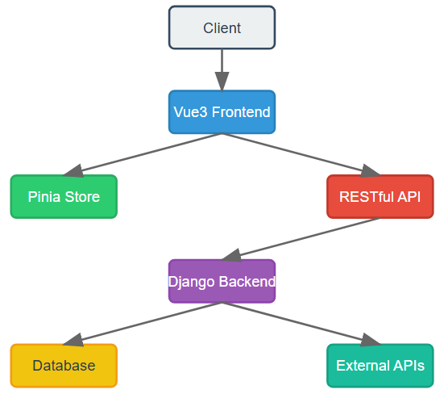

### 설계 문서
#### 와이어프레임

- 와이어 프레임(설계 단계)
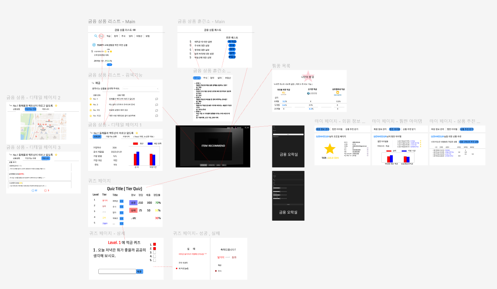
- 와이어 프레임(구현 단계)
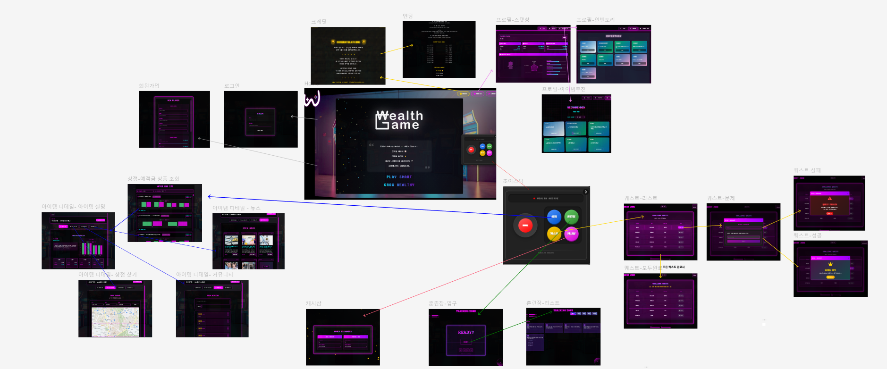

- ERD

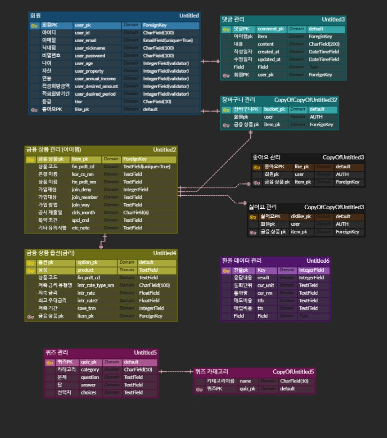

## 📌 API 명세서
# API 명세서

## Account API

| 기능 | Method | URL | 설명 | 인증필요 |
|------|--------|-----|------|----------|
| 프로필 조회 | GET | /accounts/profile_view/ | 사용자 프로필 정보 조회 | O |
| 티어 업데이트 | POST | /accounts/update_tier/ | 사용자 티어 정보 업데이트 | O |
| 회원가입 | POST | /accounts/register/ | 새로운 사용자 등록 | X |
| 회원탈퇴 | DELETE | /accounts/delete/ | 사용자 계정 삭제 | O |
| 로그인 | POST | /accounts/login/ | 사용자 로그인 | X |
| 로그아웃 | POST | /accounts/logout/ | 사용자 로그아웃 | O |
| 유사사용자 조회 | GET | /accounts/same/{category}/ | 카테고리별 유사 사용자 목록 | O |
| 랭킹 조회 | GET | /accounts/ranking/ | 전체 사용자 티어 순위 | X |

## Finlife API

| 기능 | Method | URL | 설명 | 인증필요 |
|------|--------|-----|------|----------|
| 상품 저장 | POST | /finlife/save-deposit-products/ | 예금 상품 정보 저장 | O |
| 상품 목록 | GET | /finlife/deposit-products/ | 전체 예금 상품 조회 | X |
| 상품 상세 | GET | /finlife/deposit_product_detail/<fin_prdt_cd>/ | 특정 예금 상품 상세 정보 | X |
| 상품 옵션 | GET | /finlife/deposit-products-options/<fin_prdt_cd>/ | 예금 상품 옵션 정보 | X |
| 최고금리 상품 | GET | /finlife/deposit-products/top-rate/ | 최고 금리 상품 목록 | X |
| 데이터 업로드 | POST | /finlife/recommend_upload/ | 예적금 데이터 업로드 | O |
| 상품 ID 조회 | GET | /finlife/id_to_deposit/ | 예금 상품 ID 정보 | X |
| 금리 수정 | PUT | /finlife/update_intr/ | 금리 정보 업데이트 | O |

## Exchange API

| 기능 | Method | URL | 설명 | 인증필요 |
|------|--------|-----|------|----------|
| 환율 저장 | POST | /exchange/save_exchange/ | 환율 정보 저장 | O |
| 환율 조회 | GET | /exchange/today_exchange/ | 오늘의 환율 정보 조회 | X |

## Comments API

| 기능 | Method | URL | 설명 | 인증필요 |
|------|--------|-----|------|----------|
| 댓글 목록 | GET | /comments/api/products/<product_id>/comments/ | 상품별 댓글 조회 | X |
| 댓글 작성 | POST | /comments/api/products/comments/ | 새 댓글 작성 | O |
| 댓글 수정 | PUT | /comments/api/comments/update/ | 댓글 내용 수정 | O |
| 댓글 삭제 | DELETE | /comments/api/comments/delete/ | 댓글 삭제 | O |
| 인증 확인 | GET | /comments/api/check-authentication/ | 사용자 인증 상태 확인 | X |

## Bucket API

| 기능 | Method | URL | 설명 | 인증필요 |
|------|--------|-----|------|----------|
| 장바구니 관리 | GET/POST/DELETE | /bucket/ | 장바구니 조회/추가/삭제 | O |
| 상품 확인 | GET | /bucket/have/ | 장바구니 상품 존재 여부 | O |

## Quest API

| 기능 | Method | URL | 설명 | 인증필요 |
|------|--------|-----|------|----------|
| 퀘스트 목록 | GET | /quest/list/ | 퀘스트 목록 조회 | X |

## News API

| 기능 | Method | URL | 설명 | 인증필요 |
|------|--------|-----|------|----------|
| 뉴스 조회 | GET | /news/ | 뉴스 정보 조회 | X |


# 서비스 소개 
WEALTH GAME은 금융 상품 추천 어플리케이션과 아케이드 게임을 결합시킨 금융 게임 서비스입니다.
퀘스트를 클리어하면서 금융 지식을 쌓고, 다른 유저와 경쟁하며 금융 경험치를 쌓으며, 실제 금융 상품을 비교할 수 있습니다.

###  게임적 요소(Game + Financial Education)
1. RPG 성장 시스템
   - 티어 시스템: '알거지'부터 시작해서 '건물주'까지 성장하는 재미
   - 명확한 성장 경로: 알거지 → 이자사냥꾼 → 화폐술사 → 집마스터 → 차트마스터 → 건물주
   - 각 티어별로 새로운 금융 지식과 기능 해금

2. 퀘스트 & 보상 시스템
   - 금융 퀘스트: 재미있는 퀘스트 형태로 제공되는 금융 학습
   - 즉각적인 피드백: 퀘스트 완료 시 바로 확인하는 학습 성과
   - 보상 시스템: 티어 상승, 새로운 기능 해금 등 다양한 보상 제공

3. 아케이드 스타일 UI/UX
   - 드래그 가능한 조이스틱 컨트롤러
   - 레트로 게임 감성의 디자인
   - 실제 게임기를 조작하는 듯한 인터랙티브한 경험

4. 게임형 서비스 기능
   - 인벤토리: 관심 금융 상품을 아이템처럼 수집
   - 랭킹 시스템: 다른 사용자들과의 성장 비교
   - 커스터마이징: 자신만의 투자 스타일 설정

### 실전 금융 서비스 연계
1. 맞춤형 금융 상품 추천
   - 사용자의 티어, 투자 성향에 따른 추천
   - 실시간 금융 상품 정보 제공
   - 상품 비교 및 분석 기능

2. 위치 기반 서비스
   - 주변 은행 찾기

3. 금융 정보 제공
   - 실시간 금융 뉴스
   - 상품 후기 커뮤니티
   - 투자 팁과 노하우 공유

# 서비스 대표 기능
### 1. 회원가입
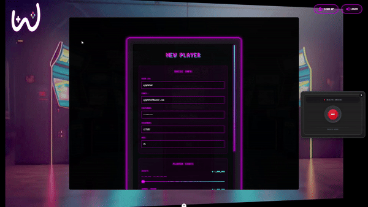
- 회원가입 시 금융상품 추천에 필요한 정보 기입
- 회원가입 시 즉시 로그인 가능
### 2. 로그인/로그아웃

- 로그인 시 조이스틱 상세 버튼 생성
- 로그아웃 시 조이스틱 상세 버튼 숨김
### 3. 마이페이지

- 회원 정보 조회 및 수정
### 4. 아이템 추천
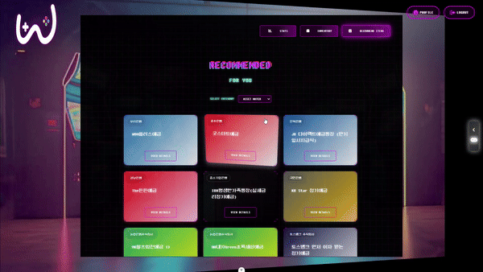
- 선택 카테고리 변경 시 추천 알고리즘에 의한 상품 추천 리스트 조회
### 5. 조이스틱 

- 로그인 상태에 따른 상세버튼 On/Off
- 토글 시 조이스틱 On/Off
### 6. 아이템 조회

- 예적금 상품 전체 조회 및 비교
- 차트 라이브러리를 활용한 시각적 자료 기능 구현
- 은행 및 가입기간 별 선택 기능 제공
### 7. 아이템 상세정보 조회

- 인벤토리 추가/제거
- 차트에 마우스 포인트 이동 시 상세 정보 조회
### 8. 금리정보 수정(이메일 발송)

- 관리자 아이디일 경우, 금리정보 수정 가능
<br>
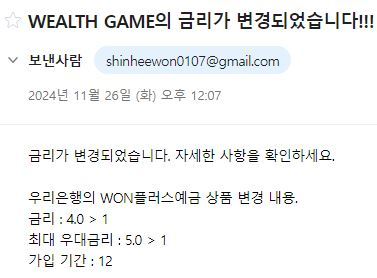
- 금리정보 수정 시 가입한 회원들에게 이메일 전송

### 9. 주변 상점 찾기

- Kakao Map API를 연결하여 주변 은행 찾기
### 10. 아이템 후기 커뮤니티

- 아이템 후기 커뮤니티 댓글 작성
- 본인이 작성한 댓글만 수정/삭제 
### 11. 아이템 관련 뉴스

- 아이템 이름으로 검색한 뉴스 정보 제공
### 12. 인벤토리
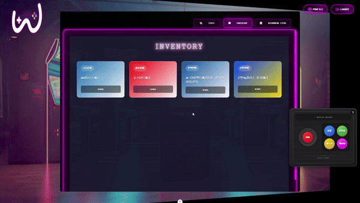
- 가입한 상품 조회 및 제거
### 13. 캐시샵

- 한국 통화에서 외국 통화 양방향 환전 기능
- 외환 투자 시 알아야 할 지식 제공
### 14. 훈련장

- 금융 상품에 대한 지식을 습득할 수 있는 훈련장 시스템 구축
- 마우스 포인트 이동 시 모법답안 제공
### 15. 퀘스트
 
- 티어에 따른 퀘스트 조회 및 성공 화면
 
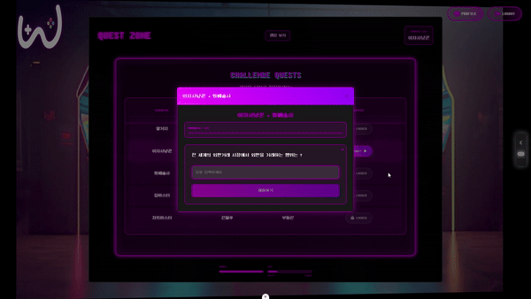
- 퀘스트 실패 화면 

### 16. 랭킹 시스템
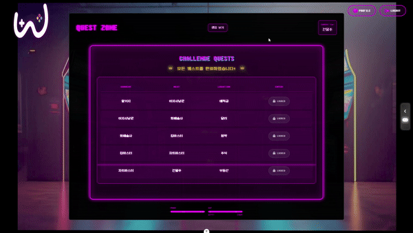
- 티어 순으로 1등에서 3등까지 유저 리스트 조회
- 같은 티어라면 자산순으로 배치

### 17. 엔딩 크레딧

- 가장 높은 건물주 티어 달성 시 엔딩 크레딧 기능 제공

# 금융 상품 추천 알고리즘
유저 더미데이터를 생성하여 나와 나이, 자산, 연봉, 희망 투자금액, 희망 투자기간, 티어가 비슷한 유저가  가입한 상품들을 추천해주는 알고리즘입니다.
<details>
<summary>알고리즘 코드보기</summary>

```python
@api_view(['GET'])
def same(request, category):
    # 비슷한 나이 필터 알고리즘
    if category == '나이':
        my_age_group = request.user.age // 10
        users = User.objects.filter(age__gte = my_age_group * 10, age__lt=(my_age_group + 1) * 10)
    
    # 비슷한 자산, 연봉, 희망 금액 카테고리 필터 알고리즘
    elif category == '카테고리':
        # 카테고리 필터링
        카테고리 = int(request.GET.get('카테고리', 0))  # 카테고리 값 받아오기
        
        # 자산 범위 구간 설정
        if 카테고리 <= 10000000:
            min_카테고리 = 1000000
            max_카테고리 = 10000000  # 100만원 이상 1000만원 이하
        elif 10000000 < assets <= 20000000:
            min_카테고리 = 10000000
            max_카테고리 = 20000000  # 1000만원 이상 2000만원 이하
        elif 20000000 < 카테고리 <= 50000000:
            min_카테고리 = 20000000
            max_카테고리 = 50000000  # 2000만원 이상 5000만원 이하
        else:
            min_카테고리 = 50000000
            max_카테고리 = 1000000000  # 5000만원 이상, 최대 금액은 10억

        # 카테고리 범위에 맞는 사용자 필터링
        users = User.objects.filter(카테고리__gte=min_카테고리, 카테고리__lte=max_카테고리)

     # 투자 희망기간 필터링
    elif category == '기간':
        desired_period = int(request.GET.get('desired_period', 0))  # 투자 희망기간 값 받아오기
        
        # 기간 범위 구간 설정
        if desired_period <= 12:
            min_period = 1
            max_period = 12  # 1~12개월
        elif 13 <= desired_period <= 24:
            min_period = 13
            max_period = 24  # 13~24개월
        elif 25 <= desired_period <= 36:
            min_period = 25
            max_period = 36  # 25~36개월
        else:
            return Response({"error": "기간은 1~36개월 사이로 설정해야 합니다."})

        # 기간 범위에 맞는 사용자 필터링
        users = User.objects.filter(desired_period__gte=min_period, desired_period__lte=max_period)

    elif category == '티어':
        tier = request.user.tier
        # 티어에 맞는 사용자 필터링
        if tier == '이자사냥꾼':
            users = User.objects.filter(tier='이자사냥꾼')
        elif tier == '알거지':
            users = User.objects.filter(tier='알거지')
        elif tier == '화폐술사':
            users = User.objects.filter(tier='화폐술사')
        elif tier == '건물주':
            users = User.objects.filter(tier='건물주')
        elif tier == '집마스터':
            users = User.objects.filter(tier='집마스터')
        elif tier == '차트마스터':
            users = User.objects.filter(tier='차트마스터')

    user_serializer = UserSerializer(users, many=True)
    
    product_ids = set()
    for user_data in user_serializer.data:
        user_id = user_data['id']
        bucket = Bucket.objects.filter(user_id=user_id)
        if bucket:
            for b in bucket:
                product_ids.add(b.product_id)

    deposit_products = DepositProducts.objects.filter(id__in=product_ids)
    deposit_product_serializer = DepositProductsSerializer(deposit_products, many=True)

    return Response(deposit_product_serializer.data)
```

</details>
<details>
<summary>나이별 상품 추천 화면</summary>

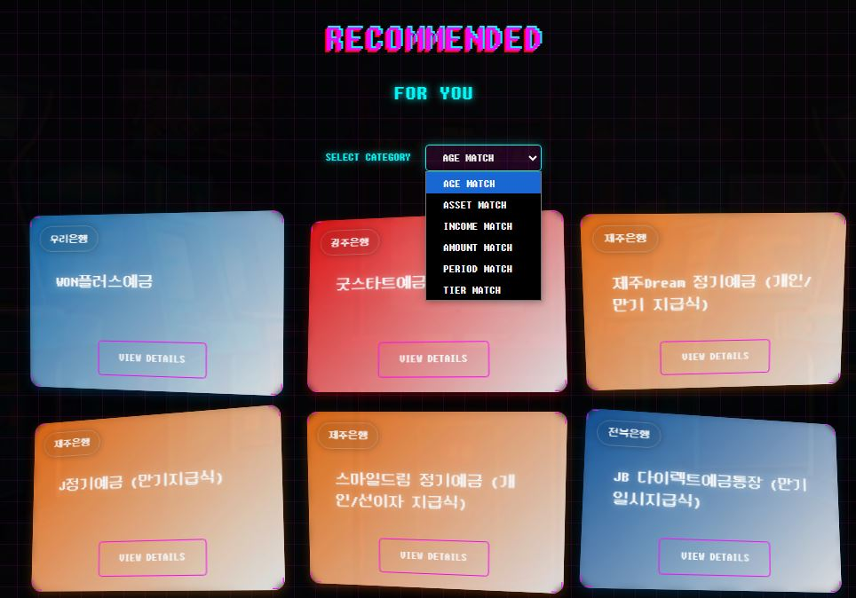

</details>
<details>
<summary>희망 투자금액별 상품 추천 화면</summary>

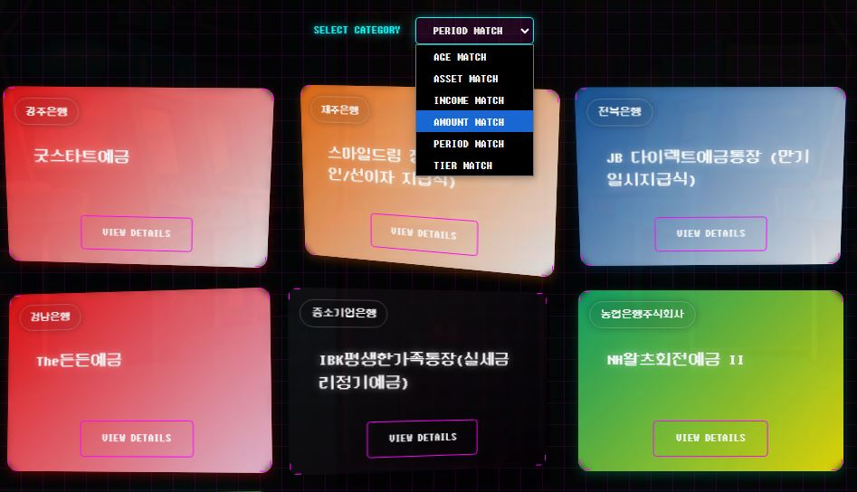

</details>
<br>

# 생성형 AI 활용

### 회원 더미데이터 생성 프롬프트
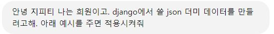 
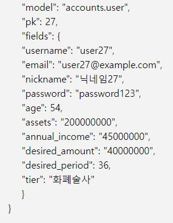 
### 회원 더미데이터 최종 응답
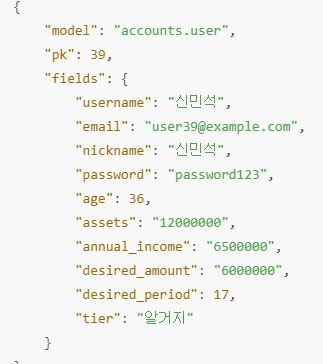


### 인벤토리 더미데이터 프롬프트 
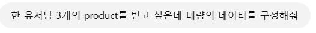
### 인벤토리 더미데이터 응답
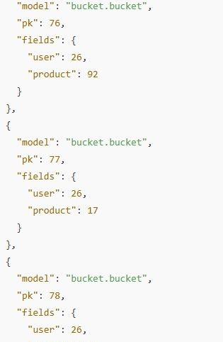 

# 🎉 프로젝트 성과 및 향후 계획
### 1. 주요 성과
- 게이미피케이션을 통한 금융 교육 플랫폼 구현
- 사용자 맞춤형 추천 알고리즘 개발
- 실시간 인터랙티브 요소 구현

### 2. 향후 발전 계획
- 실제 금융 상품 연동 확대
- 모바일 앱 버전 개발
- 소셜 기능 강화
- 게임 콘텐츠 다양화

# 프로젝트 후기
### 윤희준 (프론트엔드, 팀장)

이번 프로젝트를 통해 프론트엔드 개발자이자 팀장으로서 많은 것을 배우고 성장할 수 있었습니다.

#### 1. 기술적 도전과 성과
- **Vue3 Composition API 활용**: 
  - 특히 조이스틱 컨트롤러 구현 과정에서 반응형 상태 관리의 이점을 실감할 수 있었습니다.

- **사용자 경험 최적화**:
  - 게임적 요소를 웹 서비스에 자연스럽게 녹여내는 과정이 가장 큰 도전이었습니다.
  - 실시간 인터랙션과 애니메이션 효과를 구현하면서 성능 최적화에 대해 깊이 고민할 수 있었습니다.

#### 2. 프로젝트 관리 측면

- **위기 관리**:
  - 개발 중반에 발생한 상태 관리 이슈를 Pinia 도입으로 해결하면서 아키텍처의 중요성을 체감했습니다.
  - 예상치 못한 버그 발생 시 팀원과 함께 문제를 해결하며 협업의 가치를 배웠습니다.

#### 3. 개인적인 성장
- **리더십 경험**:
  - 기술적 의사결정과 일정 관리를 병행하면서 '기술 리더'로서의 역량을 개발할 수 있었습니다.
  - 팀원의 강점을 극대화할 수 있는 업무 분배의 중요성을 깨달았습니다.

- **사용자 중심 설계**:
  - 금융이라는 딱딱한 주제를 게임으로 풀어내면서 UX/UI에 대한 새로운 시각을 얻었습니다.
  - 실제 사용자 피드백을 반영하는 과정에서 사용자 중심 설계의 가치를 배웠습니다.

#### 4. 향후 발전 방향
- 성능 최적화와 테스트 코드 작성에 더 많은 시간을 투자하고 싶습니다.
- 게이미피케이션 요소를 더욱 발전시켜 실제 서비스로 발전시키고 싶습니다.
- 이번엔 배포를 하지 못하였지만 다음에 기회가 된다면 해보고 싶다.

이 프로젝트를 통해 기술적 성장뿐만 아니라 팀 리더로서의 경험도 쌓을 수 있었습니다. 특히 금융과 게임이라는 이질적인 요소를 결합하는 과정에서 창의적인 문제 해결 능력을 기를 수 있었습니다. 앞으로도 이런 도전적인 프로젝트를 통해 계속 성장하고 싶습니다.

### 신희원 (백엔드, 발표)
이번 프로젝트에서 백엔드 개발과 일부 프론트엔드 개발을 담당하면서 풀스택 개발자로서의 역량을 키울 수 있었습니다.

#### 1. 백엔드 개발 경험
- **API 설계 및 구현**:
- Django REST Framework를 활용하여 체계적인 API 설계를 진행했습니다.
- 외부 API(금융상품, 환율정보, 뉴스정보, 위치정보)를 효율적으로 연동하고 관리하는 방법을 익혔습니다.
- API 문서화의 중요성을 깨닫고, 명세서 작성을 통해 프론트엔드와의 원활한 협업을 경험했습니다.
- 데이터 모델링:
복잡한 금융 상품 데이터를 효율적으로 관리할 수 있는 DB 구조를 설계했습니다.
- 사용자와 상품 간의 다양한 관계(장바구니, 댓글 등)를 ERD 설계에 반영했습니다.
#### 2. 알고리즘 개발
- **금융 상품 추천 시스템**:
- 사용자의 나이, 자산, 투자성향 등을 고려한 추천 알고리즘을 개발했습니다.
- ChatGPT를 활용하여 더미데이터를 생성하고 알고리즘을 테스트할 수 있었습니다.
- 실시간 데이터 처리:
환율 정보 업데이트와 같은 실시간 데이터 처리 로직을 구현했습니다.
- 금리 변동 시 사용자에게 이메일 알림을 보내는 기능을 구현했습니다.(SMTP사용)
#### 3. 프론트엔드 도전
- **Vue.js 학습과 적용**:
- 백엔드 개발자로서 처음 접한 Vue.js를 활용해 아이템 관련 기능을 구현했습니다.
- 컴포넌트 기반 개발의 장점을 체험하고, 재사용 가능한 코드 작성의 중요성을 배웠습니다.
- 데이터 시각화:
Chart.js를 활용하여 금융 데이터를 직관적으로 표현하는 작업을 진행했습니다.
사용자 경험을 고려한 인터랙티브한 차트 구현에 성공했습니다.
#### 4. 향후 발전 방향
- 실시간 데이터 처리를 위한 비동기 프로그래밍 학습
- 테스트 코드 작성을 통한 안정성 강화
- Vue.js와 같은 프론트엔드 기술 스택 심화 학습
이번 프로젝트는 백엔드 개발자로서의 전문성을 키우는 동시에, 프론트엔드 개발에도 도전해볼 수 있는 값진 경험이었습니다. 특히 금융 도메인의 복잡한 비즈니스 로직을 구현하면서 개발자로서의 문제 해결 능력을 한층 성장시킬 수 있었습니다. 앞으로도 풀스택 개발자로서 다양한 기술 스택을 습득하고, 보다 나은 서비스를 만들기 위해 노력하겠습니다.